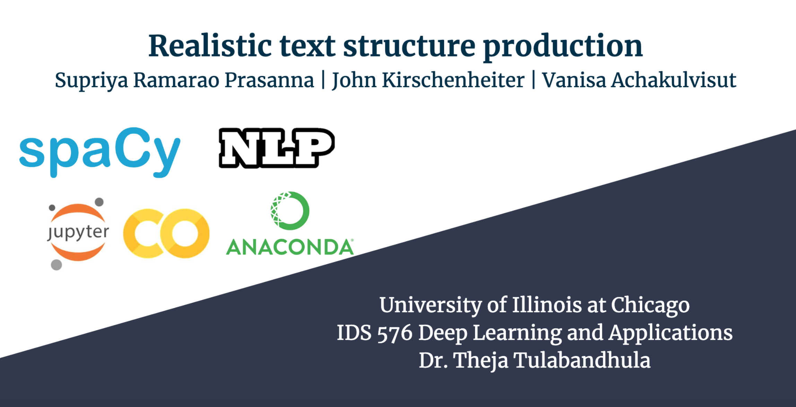

# academic-projects-msba
Attached all academic projects that had been done during my graduate school at UIC.  
- **Big Data Analytics** (PySpark, AWS)  
Project Details:  
Presentation | Slides  

- **Deep Learning** (Python)  
  
Project Details:  
Presentation | Slides | [Presentation](https://www.youtube.com/watch?v=Edg5Eg_jdAI&t=3s)  

- **Data Mining** (R)  
Project Details:  
Report | Slides  

- **Machine Learning** (R)  
Project Details:  
Report | Slides  
 
- **Advanced Databased Manangement** (SQL)  
DynamoDB Project Details:  

- **Business Data Visualization**  
[Presentation](https://www.youtube.com/watch?v=tMdUbx2HDLk)
