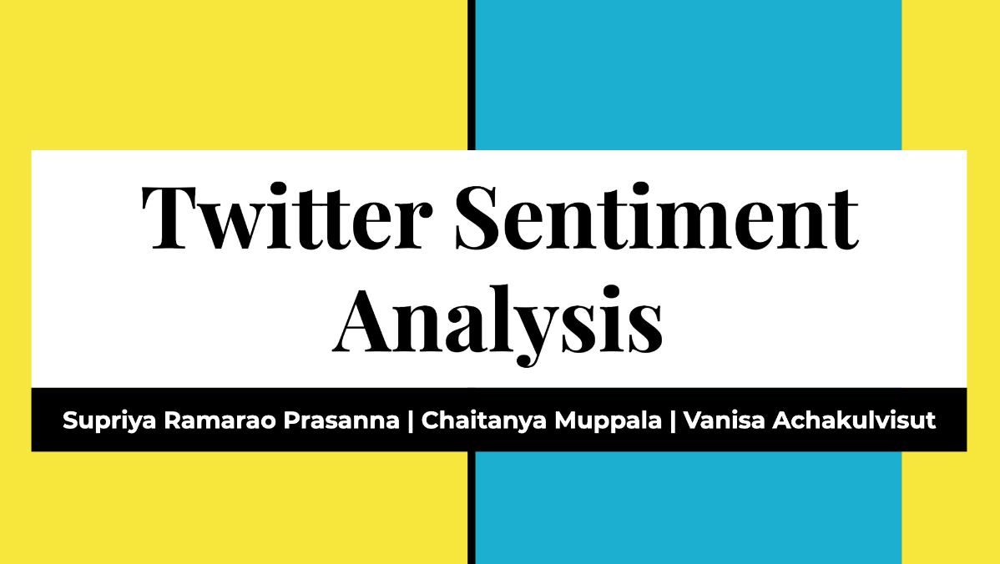
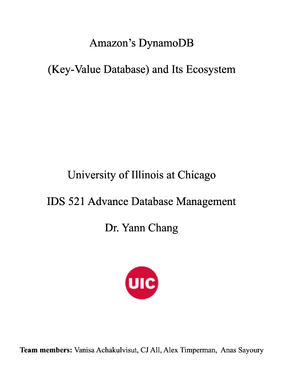
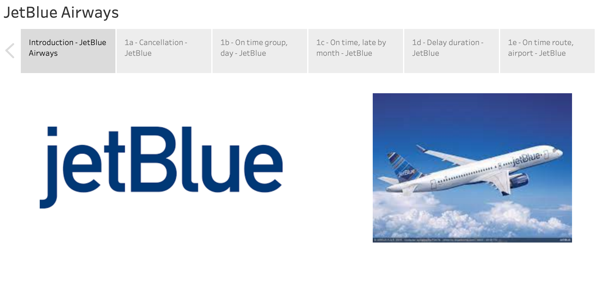

# academic-projects-msba
Attached all academic projects that had been done during my graduate school at UIC.  

- **Big Data Analytics** (PySpark, AWS)  
  
Project Details:  
Slides  

- **Deep Learning** (Python)  
 
  
 
Project Details:  
Presentation | Slides | [Presentation](https://www.youtube.com/watch?v=Edg5Eg_jdAI&t=3s)  

- **Data Mining** (R)  
Project Details:  
Report | Slides  

- **Machine Learning** (R)  
Project Details:  
Report | Slides  
 
- **Advanced Databased Manangement** (SQL)  
 
  
 
DynamoDB Project Details:  
[Paper](https://github.com/maimaiva/academic-projects-msba/blob/main/Advance%20Database%20Management/IDS521_TermPaper.pdf)  

- **Business Data Visualization**  
 
  
 
[Presentation](https://www.youtube.com/watch?v=tMdUbx2HDLk)  
